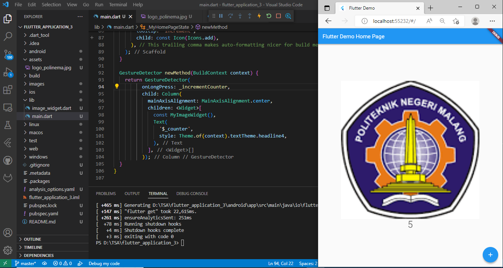
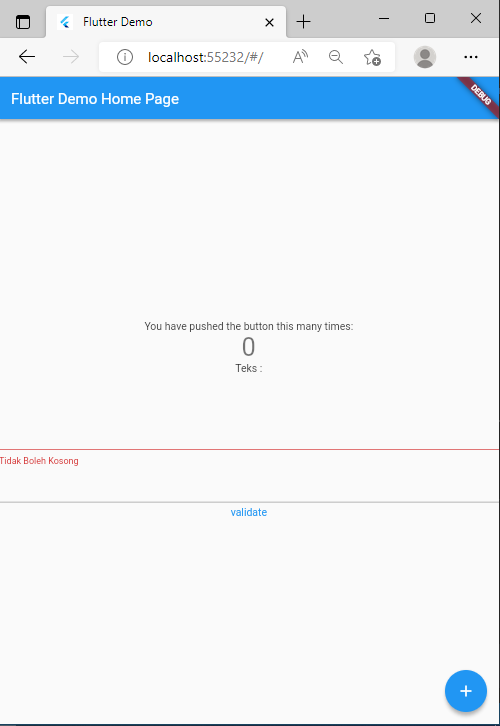
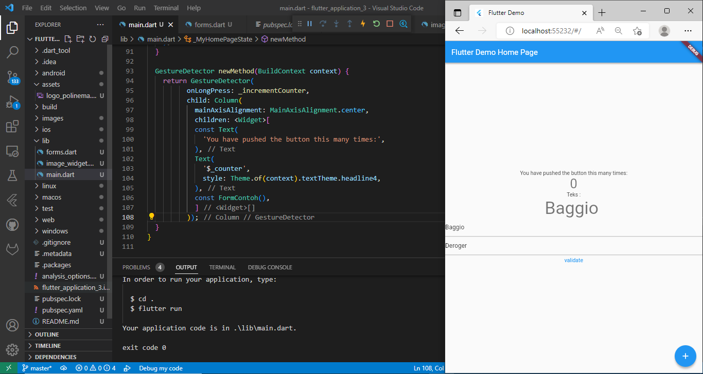
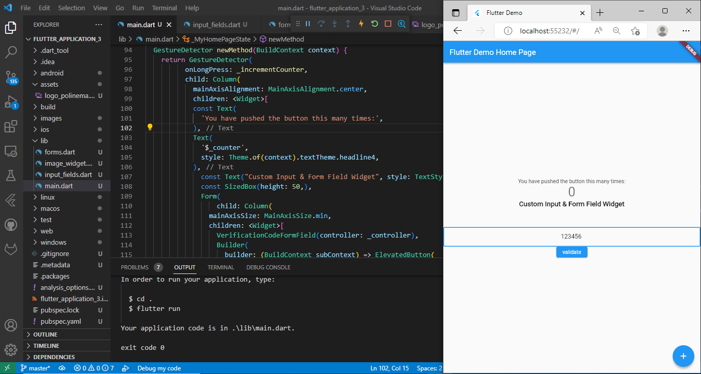

# flutter_application_3 - Baggio Deroger

- Praktikum 1: Adding Gesture Dectetor

=>On Tap: Click once to add increment

=>On Double Tap: Click twice to add increment

=>On Long Press: Click a long time to add increment

- Praktikum 2: Adding Forms to input Text
=> Validation

>>No text input

- Praktikum 3: Custom Input and adding FormField Widget

